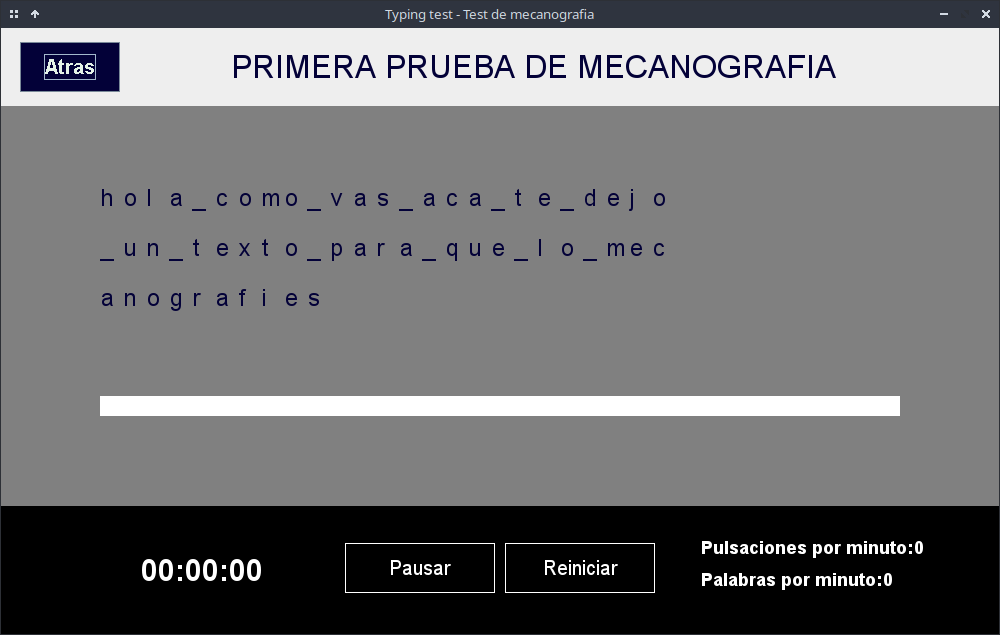

# Typing-Test-Java-AWT
This project aims to provide an interactive and efficient typing experience using Java and Java AWT (Abstract Window Toolkit). The program follows the Model-View-Presenter (MVP) architecture, promoting modularity and separation of concerns.

Screenshot of the program:

